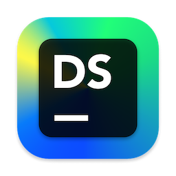
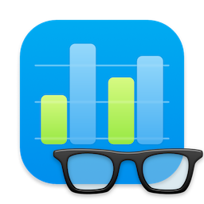
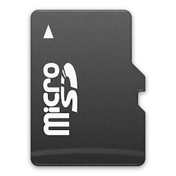

# macOS icons
> A random collection of macOS icons I made whenever I needed to

## icons
### Applications

 [DataSpell](./icons/DataSpell)                      | [Geekbench](<./icons/Geekbench>)                      | [Google Drive](<./icons/Google Drive>)                |
:---------------------------------------------------:|:-----------------------------------------------------:|:-----------------------------------------------------:|
  |    | |

### Hardwares

 [WD Blue](<./icons/WD Blue>)                        | [microSD](./icons/microSD)                            | [Crucial X6](<./icons/Crucial X6>)                    |
:---------------------------------------------------:|:-----------------------------------------------------:|:-----------------------------------------------------:|
    |      |   |
